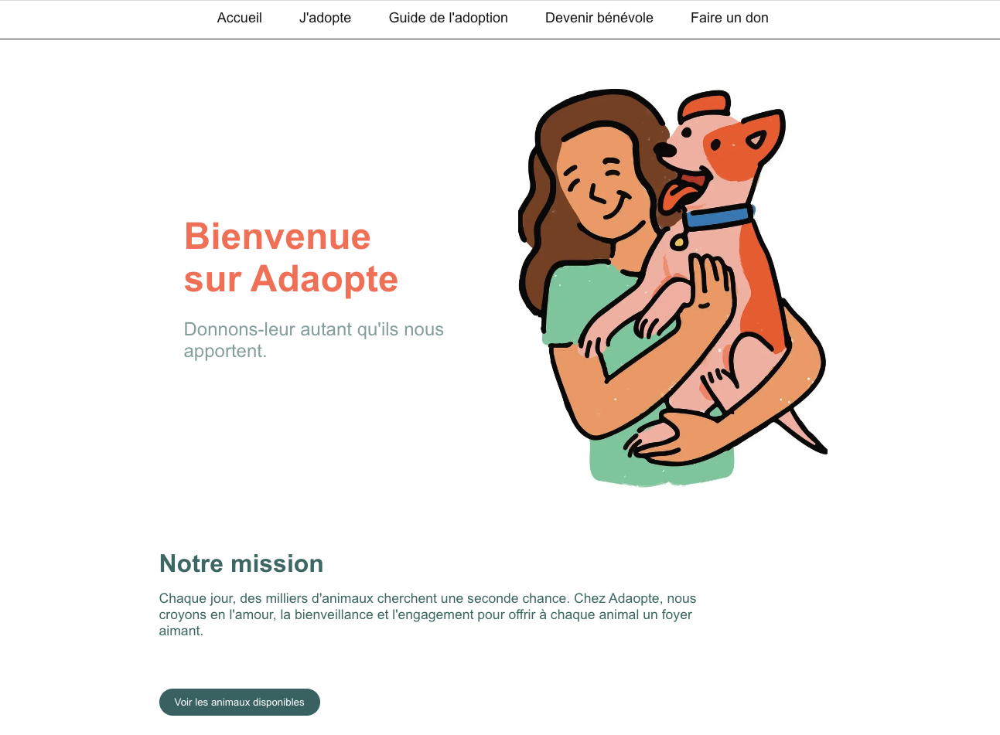

🐾 Adaopte - Plateforme d'Adoption d'Animaux
Adaopte est une application Fullstack moderne qui permet de mettre en relation des refuges et des futurs adoptants. Le projet est entièrement déployé et fonctionnel.

🚀 Liens du projet
Site en ligne : https://adaopte-front.vercel.app/

API Backend : https://adaopte-back.vercel.app/

🛠️ Stack Technique
Frontend : Next.js (App Router), React, Lucide React (Icônes).

Backend : Node.js, Express.

Base de données : PostgreSQL hébergé sur Neon.

ORM : Prisma pour la gestion des données et des migrations.

Déploiement : Vercel (CI/CD via GitHub).

✨ Fonctionnalités
Recherche Dynamique : Filtrez les animaux par type (chien, chat, lapin) et par localisation.

Gestion des Données : Affichage en temps réel des animaux depuis une base de données PostgreSQL.

Interface Responsive : Design épuré et adapté à tous les écrans avec une gestion optimisée des images (object-fit, remote patterns).

Guide d'Adoption : Un parcours utilisateur clair pour accompagner les futurs propriétaires dans leurs démarches.

📸 Aperçu

🔧 Installation Locale
Cloner le projet :

Bash

git clone https://github.com/ton-pseudo/adaopte-front.git
Installer les dépendances :

Bash

npm install
Configurer les variables d'environnement : Créez un fichier .env avec votre DATABASE_URL pour Prisma.

Lancer le projet :

Bash

npm run dev